# Film Factory

Film Factory is a **Kotlin Multiplatform (KMP)** application that helps creators ideate, script, record, edit, and publish short-form video content effortlessly. It targets Android and iOS (with shared UI via Compose Multiplatform).

## Features

Film Factory provides a complete studio experience right on your device, seamlessly flowing through these core stages:

*   **Writer's Room**: Got an idea? Enter a prompt and set your target duration. The app uses Gemini AI to generate a properly paced script with timestamps (e.g., "0s-5s"). You can freely edit the generated text before moving on.
*   **Recording Studio**: A built-in teleprompter syncs with your script's timestamps. Record using a custom native `UIKitView` / `AndroidView` front-facing camera integration while the teleprompter guides you, complete with countdowns and buffered transition segments.
*   **Editing Studio**: After recording, dive into a precision timeline. Fine-tune your clips by selecting blocks in tenth-of-a-second increments. Mark mistakes or bad takes to easily skip and remove them from the final cut.
*   **Publishing Studio**: Preview your cleanly trimmed video (automatically stitching past your removed frames) and seamlessly export or share it directly to external channels like YouTube Shorts or your native Photos app. Hard-coded multi-line captions are cleanly rendered into the final AV export using `CoreAnimation` / `MediaMuxer` logic.
*   **Archives**: Need to revisit a past project? The Archives let you see past videos or scripts and restore an archived project to its exact active status to resume editing.

### Writer's Room Flow

**Enter Prompt & Duration**  
[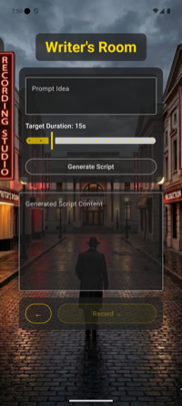](.changereview/1_writers_room/images/displayState4.png)

**Generate Script**  
[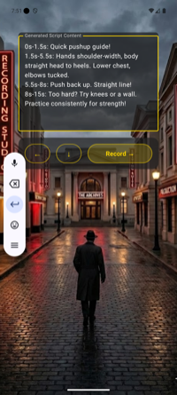](.changereview/1_writers_room/images/displayState7.png)

**Edit & Proceed**  
[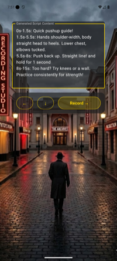](.changereview/1_writers_room/images/displayState10.png)

---

### Recording Studio Flow

**Start Recording**  
[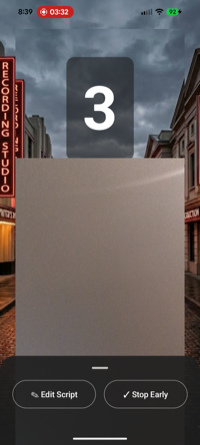](.changereview/4_publishing_studio/images/displayState6.png)

**Teleprompter Progress**  
[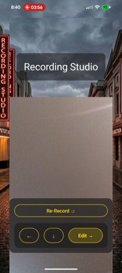](.changereview/4_publishing_studio/images/displayState8.png)

**Stop & Advance**  
[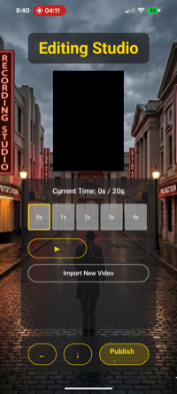](.changereview/4_publishing_studio/images/displayState9.png)

---

### Editing Studio Flow

**Fine-Tune Timeline**  
[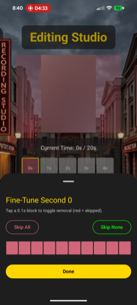](.changereview/4_publishing_studio/images/displayState11.png)

**Mark Bad Takes**  
[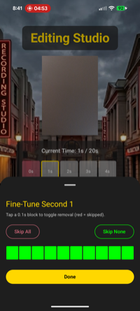](.changereview/4_publishing_studio/images/displayState13.png)

**Preview Output**  
[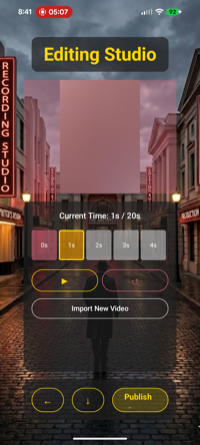](.changereview/4_publishing_studio/images/displayState15.png)

---

### Publishing Studio Flow

**Final Preview**  
[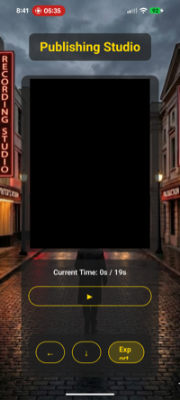](.changereview/4_publishing_studio/images/displayState17.png)

**Play Clean Cut**  
[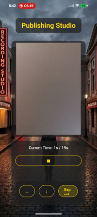](.changereview/4_publishing_studio/images/displayState18.png)

**Export / Share**  
[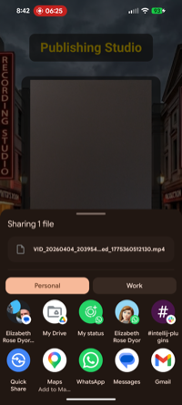](.changereview/4_publishing_studio/images/displayState21.png)

---

## Project Structure

* [/iosApp](./iosApp/iosApp) contains iOS applications. Even if you’re sharing your UI with Compose Multiplatform, you need this entry point for your iOS app. This is also where you should add SwiftUI code for your project.
* [/shared](./shared/src) is for code that will be shared across your Compose Multiplatform applications. It contains several subfolders:
  - [commonMain](./shared/src/commonMain/kotlin) is for code that’s common for all targets.
  - Other folders are for Kotlin code that will be compiled for only the platform indicated in the folder name. For example, if you want to use Apple’s CoreCrypto for the iOS part of your Kotlin app, the [iosMain](./shared/src/iosMain/kotlin) folder would be the right place for such calls.

## Building and Running

### Android Application
To build and run the development version of the Android app, use the run configuration from the run widget in your IDE’s toolbar or build it directly from the terminal:
- on macOS/Linux
  ```shell
  ./gradlew :androidApp:assembleDebug
  ```
- on Windows
  ```shell
  .\gradlew.bat :androidApp:assembleDebug
  ```

### iOS Application
To build and run the development version of the iOS app, use the run configuration from the run widget in your IDE’s toolbar or open the [/iosApp](./iosApp) directory in Xcode and run it from there.

---

## License

**MIT License**

Copyright (c) 2024

Permission is hereby granted, free of charge, to any person obtaining a copy
of this software and associated documentation files (the "Software"), to deal
in the Software without restriction, including without limitation the rights
to use, copy, modify, merge, publish, distribute, sublicense, and/or sell
copies of the Software, and to permit persons to whom the Software is
furnished to do so, subject to the following conditions:

The above copyright notice and this permission notice shall be included in all
copies or substantial portions of the Software.

THE SOFTWARE IS PROVIDED "AS IS", WITHOUT WARRANTY OF ANY KIND, EXPRESS OR
IMPLIED, INCLUDING BUT NOT LIMITED TO THE WARRANTIES OF MERCHANTABILITY,
FITNESS FOR A PARTICULAR PURPOSE AND NONINFRINGEMENT. IN NO EVENT SHALL THE
AUTHORS OR COPYRIGHT HOLDERS BE LIABLE FOR ANY CLAIM, DAMAGES OR OTHER
LIABILITY, WHETHER IN AN ACTION OF CONTRACT, TORT OR OTHERWISE, ARISING FROM,
OUT OF OR IN CONNECTION WITH THE SOFTWARE OR THE USE OR OTHER DEALINGS IN THE
SOFTWARE.